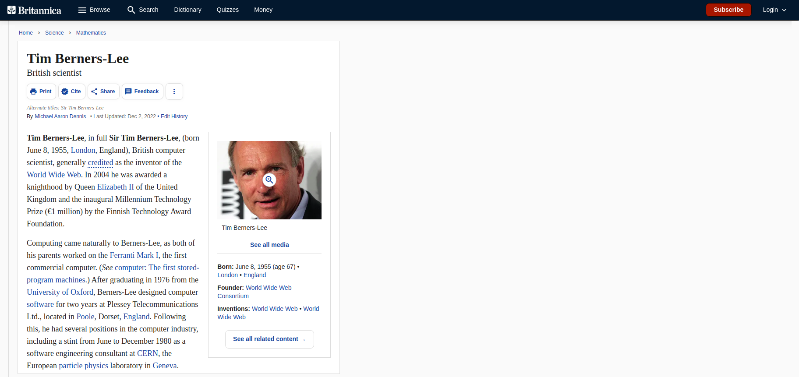

# Tim Berners-Lee challenge

Challenge: Integrate website from screenshots maquettes

- Timing: 5 hours
- Goals: Challenge HTML & CSS
- Solo challenge

## See it live 

Click here to see the [live version](https://bschutters.github.io/tim-berners-lee/)

## Technologies Used

Check the pkg.json for a complete list. But the most notable ones are:

- `vite` 
- `html` 
- `css`

## Screenshots maquettes
- Desktop
  

  - Mobile 

  
  

---

&copy; 2023